# How to use BigBlueButton

Don't use any Mobile App, use Firefox or Google Chrome browser's latest version on Mobile / Laptop / Desktop.

All images are for Laptop / Desktop, for Mobile layout may vary.

Open website [gdy.club/guru](https://gdy.club/guru)

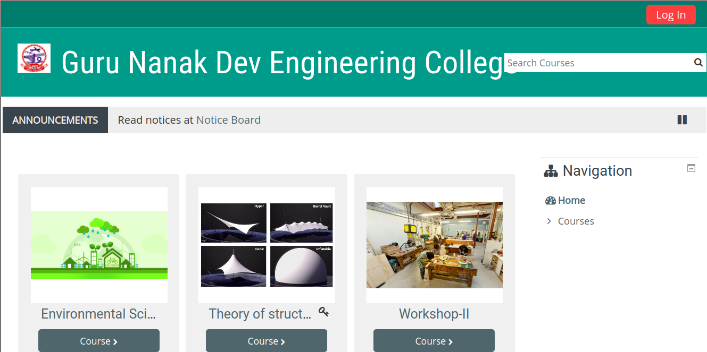

Look for `Log In` on top right. Use your login credential, and click on button `Log in`.

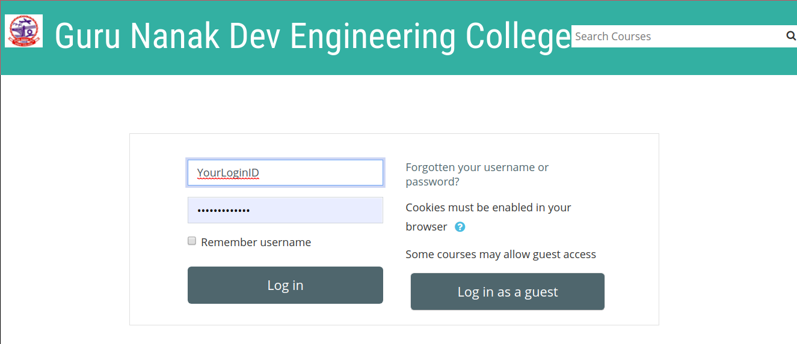

Open website [gdy.club/bbb](https://gdy.club/bbb), use Enrolment, conveyed to use by Text Message.

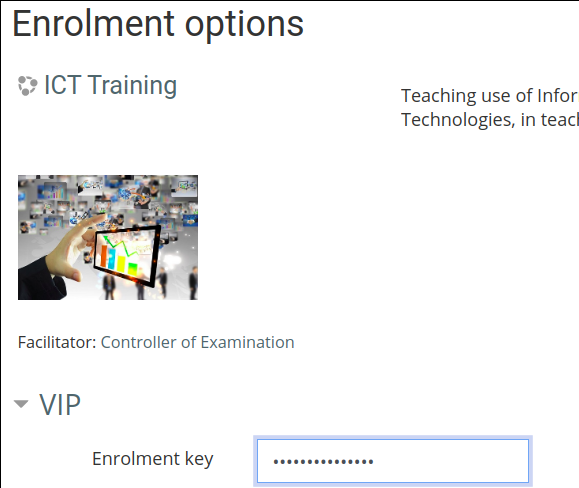

Click on Enrol me.

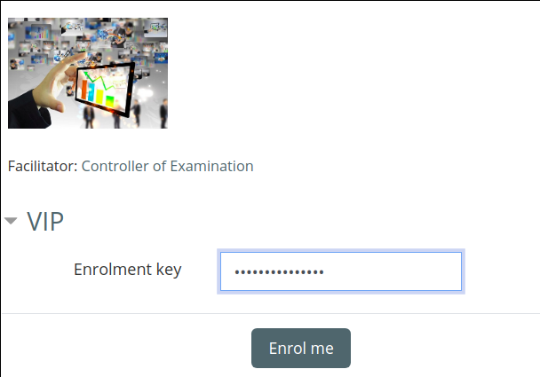1

If you see not text immediately below `Announcement`, and above `Remote Teaching`:

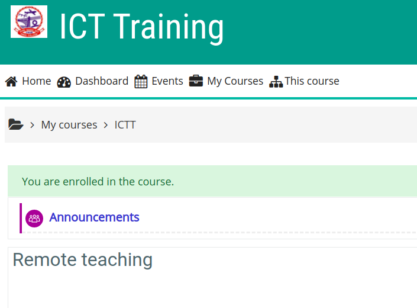

then, click your profile image, or name, to get drop-down images.

Click on `preferences`.

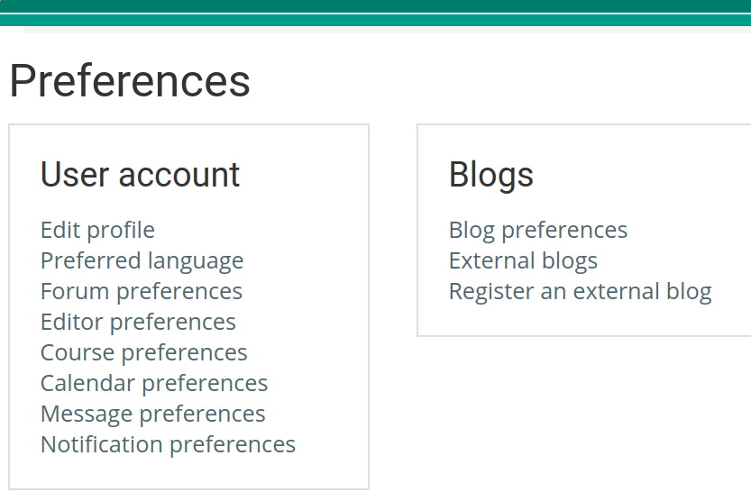

Click on `Forum preferences`. Make sure settings are as per image below:

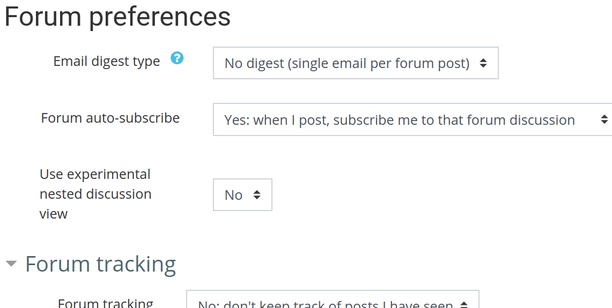

Also set `Forum Tracking` as per image below:

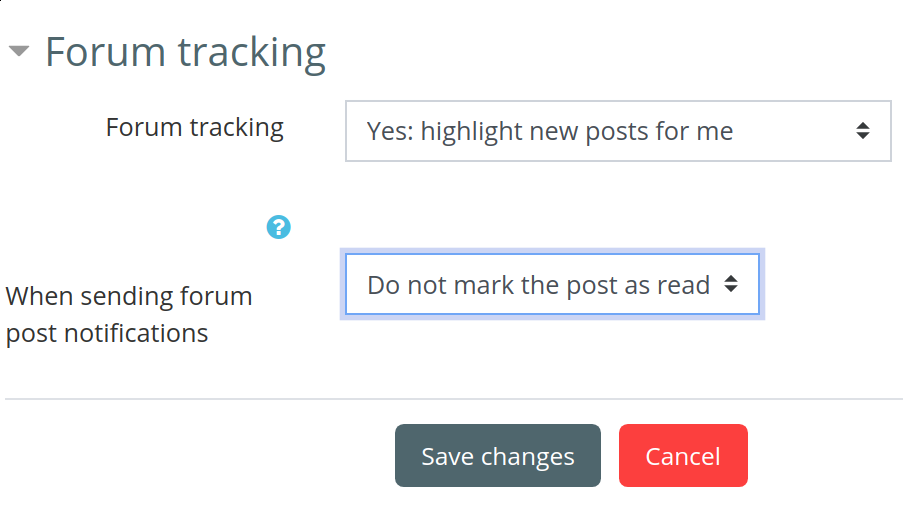

Click on `Save images`

Now you see coun tof unread messaged.

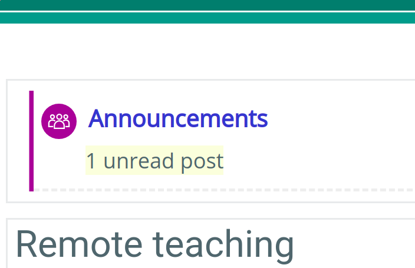

Please read posts in Announcement Forum.

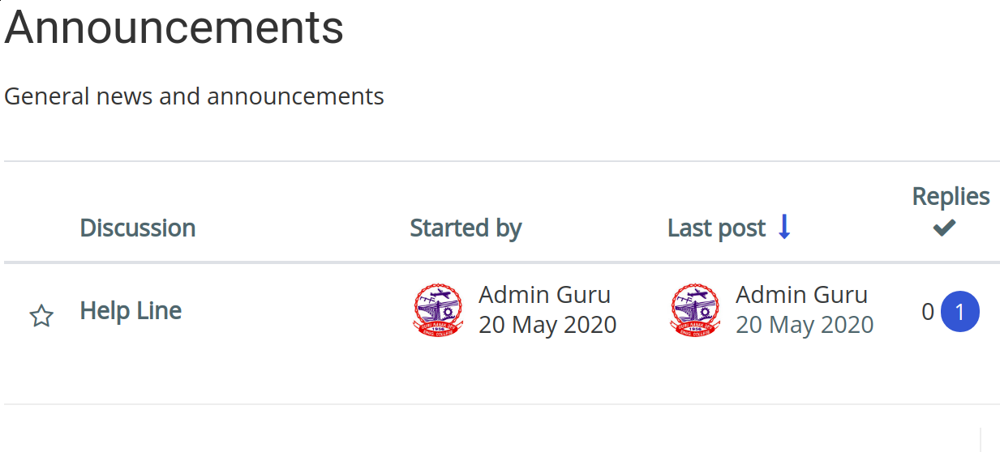

Now, click on `Remote Teaching`, which is below `Announcements`.

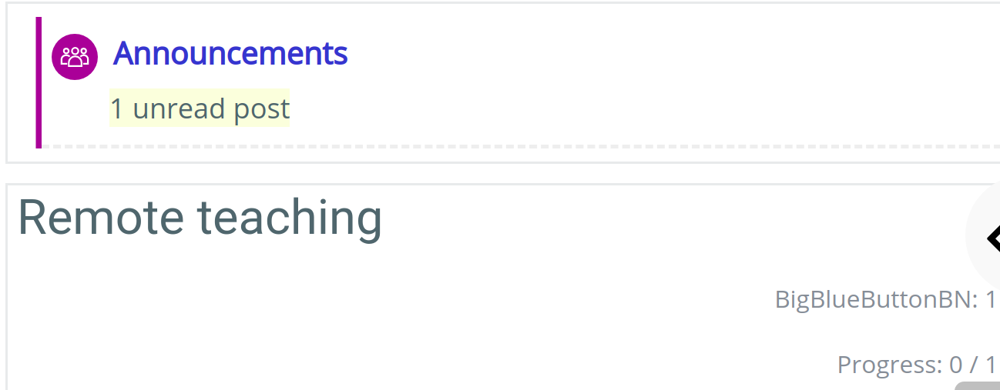

Read all text there, and click on `BBB: Way to ride`.

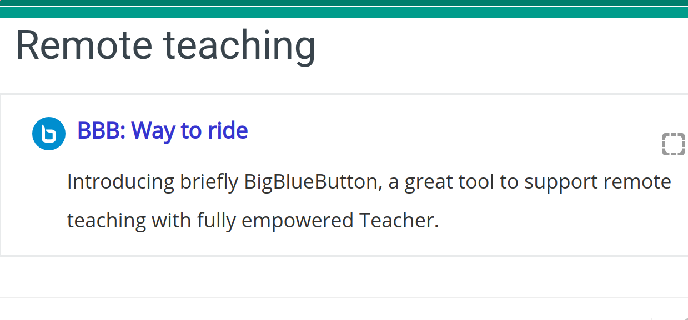

Read next secreen, find `Join session`, and click on that to join Video Lecture:

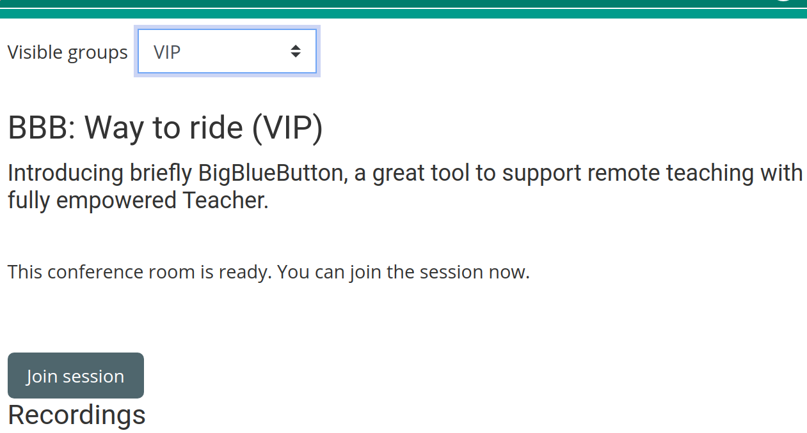

If you need to listen only, then click on 2nd icon, else click on `Microphone`.

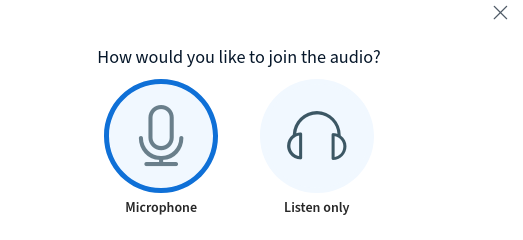

Then you need to perform echo test. 

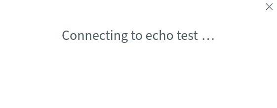

When prompted, speak a very short word, like `A`, and listen, if you are able to hear, toyr spoken word, after a short delay, then your setting or OK, and press click on `Yes`, else click `No`. 

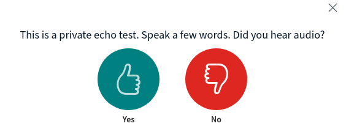

from the different available options for Speaker and Mic, check which works for you.

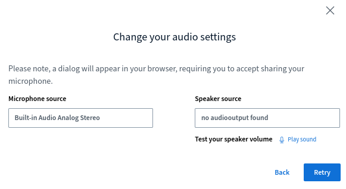

 Repeat echo test, till you are able you listen your echo. Once you are able to do that, then, click `Yes`.

It will allow system you to join Video Conferencing, with following default screen.

