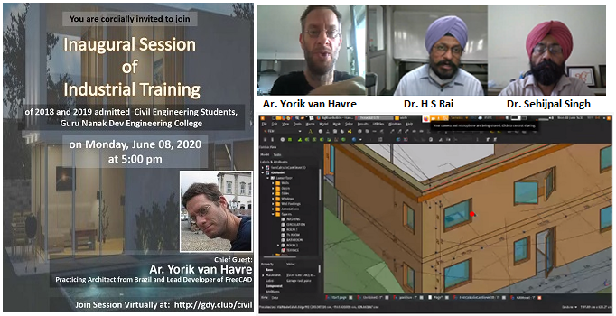

# Online  Training Inaugurated

### 4 Weeks Industrial Software Training for Students of Civil Engineering Department, GNDEC commenced through online mode

June 08, 2020

Keeping in view the current prevailing situation due to COVID-19, 
the Department of Civil Engineering, Guru Nanak Dev Engineering College (GNDEC)
has modelled the Industrial Training for its students through online mode. 
Four week software training for batch 2018-22 and 2019-23 commenced from 
June 08, 2020 onwards with a virtual inaugural session. 
Dr H S Rai, Professor & Head, Department of Civil Engineering, 
welcoming all the participants outlined the essence of upcoming
training program. He emphasised that the training is going to be a
wonderful experience, with a team of Inter-disciplinary faculty.
He added that, keeping in view the revolution and increasing need of
Modelling and Simulation, Open Source softwares including Blender, Scilab, 
Solid Modeling through Python, OpenModelica and QGIS will be covered
in the training program.

Followed by this, Dr (Prof) Harpal Singh, gave 
an introductory presentation to the participants on Object Oriented Modelling
and Simulation with OpenModelica. During the inaugural session, 
Dr H S Rai presented the list of students of GNDEC along 
with their achievements and ongoing projects in the field 
of Open-Source Softwares and encouraged the budding learners to explore
the wonderful possibilities through this learning.

Chief Guest of the inaugural session, Ar. Yorik van Havre,
Practicing Architect from Brazil and Lead Developer of FreeCAD,
graced the occasion and enlightened the participants with his rich
experience in the world of Modelling and Simulation. Besides presenting
the vast possibilities of exploring these softwares, 
he emphasised on the importance of Open Source softwares over other 
proprietary softwares.

Dr Sehijpal Singh, Principal, GNDEC, said that 
multi-disciplinary training aiming sustainability is the need of an hour. 
He encouraged students to use this opportunity fruitfully.
He expressed his heartiest congratulation to the department of
Civil Engineering and the entire training team. 

In the end, Dr (Prof) Gurdeepak Singh extended the vote of thanks. 

